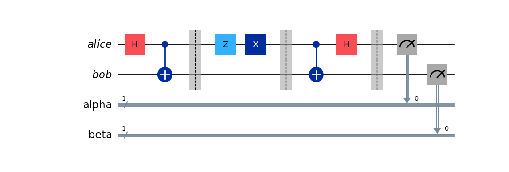

# Quantum-Computing
This repository contains examples of quantum systems built using IBM's Qiskit quantum computing SDK.

## Superdense Coding

Superdesnse coding is a method of encoding two classical bits of information into a single qubit. This is done by entangling two qubits and then applying a series of quantum gates to the qubit that contains the information. The qubit is then sent to the receiver who can decode the information by applying a series of quantum gates to the qubit.
In this example "Alice" is the sender and "Bob" is the receiver. 

#### Example of 11 Superdense Coding

